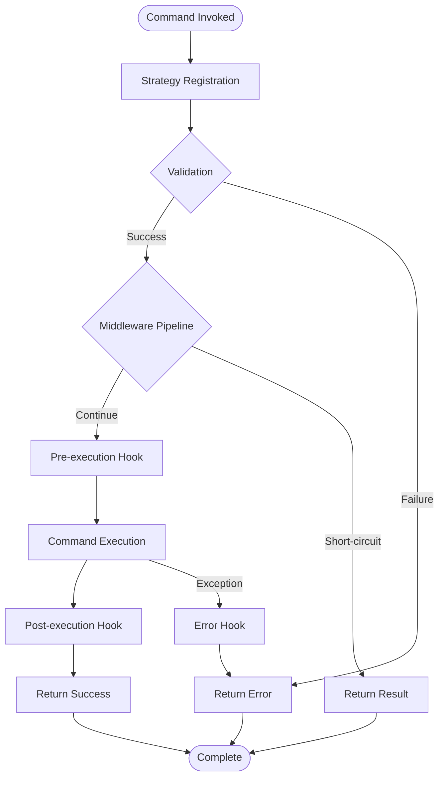

# Command Foundation

## Overview

The command foundation provides the core abstractions and base classes for all CLI commands. It
follows clean architecture principles with clear separation of concerns across three layers.

## Architecture

```
command_foundation/
├── domain/                    # Core abstractions and interfaces
├── application/               # Business logic and orchestration
└── infrastructure/            # Concrete implementations
```

## Layer Organization

### Domain Layer (`domain/`)

**Purpose:** Core abstractions that define the contract for commands

**Files:**

- `command_context.dart` - Execution context interface
- `command_lifecycle.dart` - Lifecycle hook interfaces
- `command_middleware.dart` - Middleware interface
- `command_result.dart` - Standardized result types
- `command_validator.dart` - Validation interface
- `fly_command_strategy.dart` - Command strategy interface

**Principles:**

- No dependencies on other layers
- Pure abstractions/interfaces
- Business rule definitions

### Application Layer (`application/`)

**Purpose:** Orchestrates domain concepts and implements business logic

**Files:**

- `command_base.dart` - Base FlyCommand implementation
- `command_discovery.dart` - Strategy registry
- `command_registration.dart` - Bootstrap registration
- `fly_command_strategy_registry.dart` - Legacy strategy registry

**Principles:**

- Depends only on domain
- Implements business logic
- Coordinates domain objects

### Infrastructure Layer (`infrastructure/`)

**Purpose:** Provides concrete implementations of domain abstractions

**Files:**

- `command_context_impl.dart` - Concrete CommandContext
- `mandatory_middleware.dart` - Mandatory middleware implementations
- `interactive_prompt.dart` - User interaction utilities

**Principles:**

- Implements domain interfaces
- Handles external concerns (I/O, etc.)
- Platform-specific details

## Command Execution Flow



## Key Abstractions

### CommandContext

Provides access to all dependencies and configuration:

- Logger
- Template manager
- System checker
- Path resolver
- Interactive prompt

### FlyCommand

Base class for all commands with:

- Lifecycle hooks
- Middleware pipeline
- Validation chain
- Error handling

### CommandStrategy

Registry pattern for command metadata:

- Name, description, aliases
- Grouping and categorization
- Factory for instances

### Middleware

Cross-cutting concerns:

- Logging
- Metrics
- Dry-run support
- Caching

### Validation

Composable validation rules:

- Required arguments
- Format validation
- Environment checks

## Usage Examples

### Creating a New Command

```dart
// 1. Define strategy (in features/)
class MyCommandStrategy extends FlyCommandStrategy {
  @override
  String get name => 'my-command';
  
  @override
  String get description => 'Does something useful';
  
  @override
  List<String> get aliases => ['mc'];
  
  @override
  CommandGroup? get group => null;
  
  @override
  CommandCategory get category => CommandCategory.generation;
  
  @override
  Command<int> createInstance(CommandContext context) {
    return MyCommand.create(context);
  }
}

// 2. Implement command
class MyCommand extends FlyCommand {
  MyCommand(CommandContext context) : super(context);
  
  factory MyCommand.create(CommandContext context) => MyCommand(context);

  @override
  String get name => 'my-command';

  @override
  String get description => 'Does something useful';

  @override
  Future<CommandResult> execute() async {
    return CommandResult.success(
      command: name,
      message: 'Done!',
    );
  }
}

// 3. Register (in command_registration.dart)
registry.registerStrategy(
  'my-command',
  () => MyCommandStrategy(),
);
```

### Adding Validation

```dart
@override
List<CommandValidator> get validators => [
  const RequiredArgumentValidator('target'),
  const PathValidator('target'),
];
```

### Adding Middleware

```dart
@override
List<CommandMiddleware> get middleware => [
  LoggingMiddleware(),
  MetricsMiddleware(),
];
```

## Design Principles

1. **Dependency Inversion** - Domain defines abstractions, infrastructure implements
2. **Single Responsibility** - Each class has one clear purpose
3. **Open/Closed** - Open for extension (new commands), closed for modification
4. **Interface Segregation** - Focused interfaces (Context, Lifecycle, etc.)
5. **Clean Architecture** - Clear layer boundaries with dependency rules

## Migration Notes

This directory was reorganized from a flat structure to follow clean architecture layering. All
imports have been updated to reflect the new structure:

**Old:**

```dart
import 'package:fly_cli/src/core/command/foundation/command_context.dart';
```

**New:**

```dart
import 'package:fly_cli/src/core/command/foundation/domain/command_context.dart';
```

## Related Documentation

- `../../../FILE_SYSTEM_ANALYSIS_AND_RECOMMENDATIONS.md` - Organization analysis
- `../../../lib/src/README.md` - Overall source structure
- `core/logging/README.md` - Logging system (excellent example)
- `core/scaffolding/README.md` - Template management

