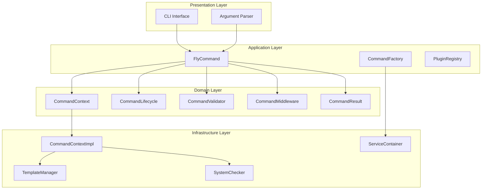
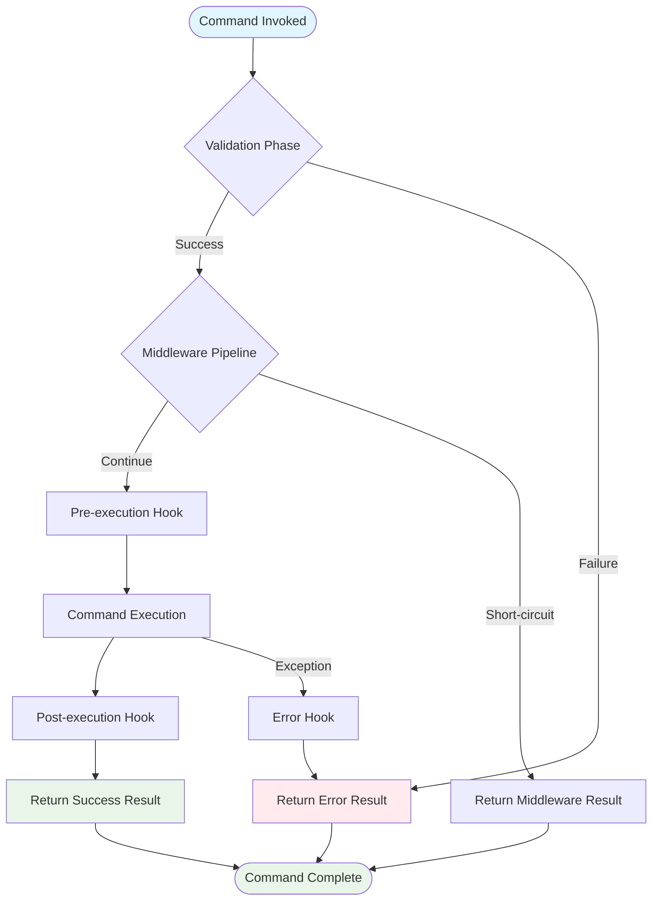
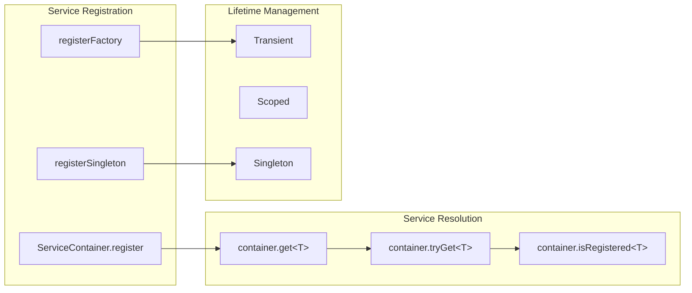
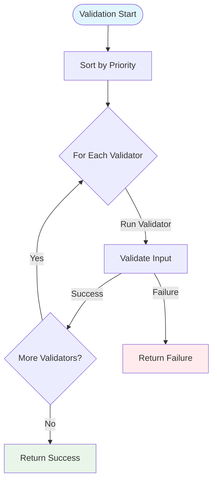
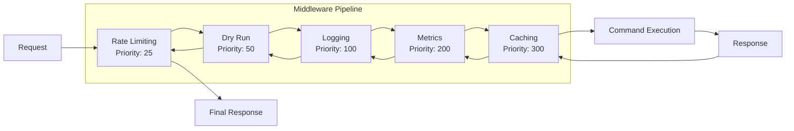
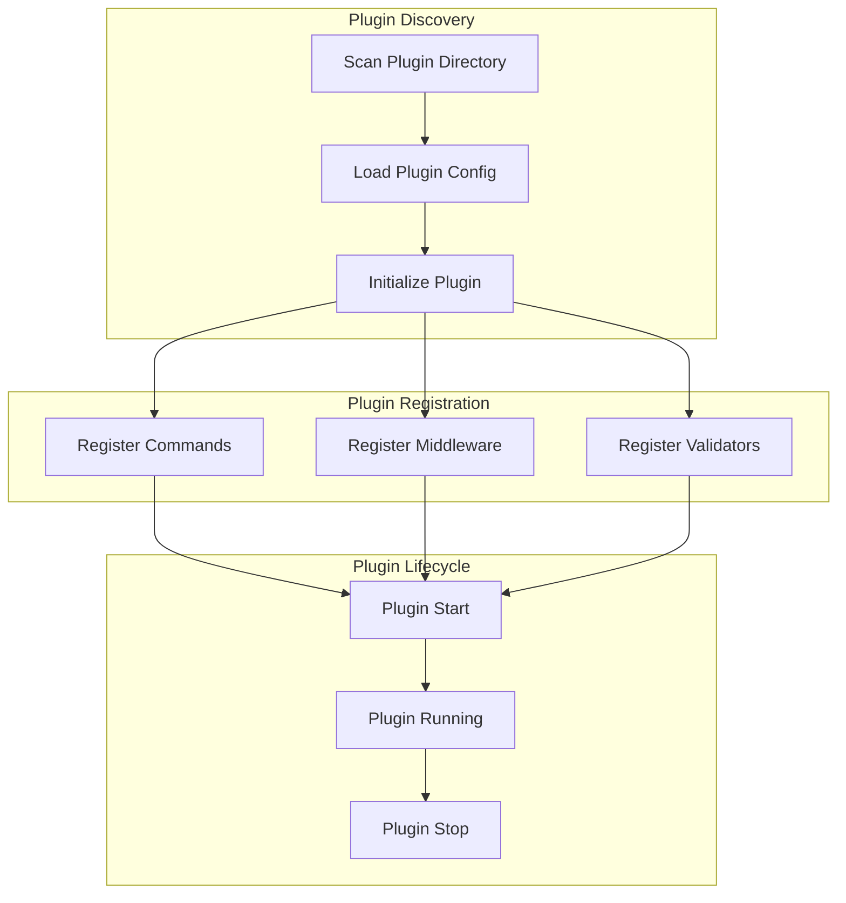

# Fly CLI Command Architecture

## Overview

The Fly CLI command architecture follows SOLID principles and clean architecture patterns to provide
a scalable, maintainable, and extensible foundation for rapid command expansion. The architecture
supports dependency injection, middleware pipelines, validation chains, lifecycle hooks, and plugin
systems.

## Table of Contents

- [Architecture Overview](#architecture-overview)
- [Core Components](#core-components)
- [Command Execution Flow](#command-execution-flow)
- [Feature Directory Structure](#feature-directory-structure)
- [Dependency Injection System](#dependency-injection-system)
- [Validation Pipeline](#validation-pipeline)
- [Middleware System](#middleware-system)
- [Plugin Architecture](#plugin-architecture)
- [Creating New Commands](#creating-new-commands)
- [Best Practices](#best-practices)
- [Testing](#testing)

## Architecture Overview

The Fly CLI follows a layered architecture pattern with clear separation of concerns:



## Core Components

### 1. Command Foundation (`core/command_foundation/`)

The command foundation provides the core abstractions and base classes for all commands.

#### Domain Layer
- **`CommandContext`** - Encapsulates execution context with dependencies and configuration
- **`CommandLifecycle`** - Defines lifecycle hooks for command execution phases  
- **`CommandMiddleware`** - Interface for cross-cutting concerns
- **`CommandValidator`** - Interface for validation logic
- **`CommandResult`** - Standardized result structure with AI-friendly formats

#### Application Layer
- **`FlyCommand`** - Enhanced base command class with integrated features

#### Infrastructure Layer
- **`CommandContextImpl`** - Concrete implementation of CommandContext
- **`Environment`** - Environment information abstraction

### 2. Dependency Injection (`core/dependency_injection/`)

Factory-based dependency injection system for managing service lifecycles and dependencies.

#### Domain Layer
- **`ServiceContainer`** - Service registration and resolution container
- **`ServiceLifetime`** - Service lifetime management (transient, scoped, singleton)

#### Application Layer
- **`CommandFactory`** - Factory for creating commands with injected dependencies

### 3. Validation System (`core/validation/`)

Composable validation pipeline with common validators for argument and environment validation.

#### Validators
- **`RequiredArgumentValidator`** - Validates required arguments
- **`ProjectNameValidator`** - Validates project name format
- **`FlutterProjectValidator`** - Validates Flutter project structure
- **`DirectoryWritableValidator`** - Validates directory permissions
- **`TemplateExistsValidator`** - Validates template availability
- **`EnvironmentValidator`** - Validates environment prerequisites
- **`NetworkValidator`** - Validates network connectivity

### 4. Middleware System (`core/middleware/`)

Pipeline-based middleware for cross-cutting concerns.

#### Built-in Middleware
- **`LoggingMiddleware`** - Command execution logging
- **`MetricsMiddleware`** - Performance metrics collection
- **`DryRunMiddleware`** - Plan mode execution
- **`CachingMiddleware`** - Result caching
- **`RateLimitingMiddleware`** - Request rate limiting

### 5. Plugin System (`core/plugins/`)

Extensible plugin architecture for third-party command registration.

#### Domain Layer
- **`FlyPlugin`** - Base plugin interface
- **`PluginContext`** - Plugin initialization context
- **`PluginConfig`** - Plugin configuration model

#### Application Layer
- **`PluginRegistry`** - Plugin discovery, loading, and lifecycle management

## Command Execution Flow

Commands follow a structured execution lifecycle with clear phases:



### Execution Phases

1. **Validation Phase** - Run all registered validators in priority order
2. **Middleware Pipeline** - Execute middleware in priority order
3. **Pre-execution Hook** - Call `onBeforeExecute()`
4. **Command Execution** - Run the main `execute()` method
5. **Post-execution Hook** - Call `onAfterExecute()`
6. **Error Handling** - Call `onError()` if exceptions occur

## Feature Directory Structure

The `features/` directory contains all command implementations organized by feature:

```
features/
├── completion/          # Shell completion generation
│   ├── application/     # Completion command implementation
│   ├── domain/          # Completion generation interfaces
│   └── infrastructure/  # Shell-specific generators
├── context/             # Project context analysis
│   ├── application/     # Context command implementation
│   ├── domain/          # Context models and interfaces
│   └── infrastructure/  # Analysis engines and detectors
├── create/              # Project creation
│   └── application/     # Create command implementation
├── doctor/              # System health checks
│   ├── application/     # Doctor command implementation
│   ├── domain/          # System checker interfaces
│   └── infrastructure/  # Platform-specific checks
├── schema/              # Command schema generation
│   ├── application/     # Schema command implementation
│   ├── domain/          # Schema definitions and formats
│   └── infrastructure/  # Export format implementations
├── screen/              # Screen generation
│   └── application/     # Add screen command implementation
├── service/             # Service generation
│   └── application/     # Add service command implementation
└── version/             # Version information
    └── application/     # Version command implementation
```

## Dependency Injection System

The dependency injection system provides a clean way to manage service lifecycles and dependencies:



### Service Registration Example

```dart
final container = ServiceContainer()
  ..registerSingleton<Logger>(Logger())
  ..register<TemplateManager>((c) => TemplateManager(...))
  ..registerSingleton<SystemChecker>(SystemChecker());
```

### Service Resolution Example

```dart
final logger = container.get<Logger>();
final templateManager = container.get<TemplateManager>();
```

## Validation Pipeline

The validation system provides a composable pipeline for validating command inputs:



### Validator Priority Order

1. **Required Arguments** (Priority 100) - Validate required arguments are present
2. **Project Name** (Priority 200) - Validate project name format
3. **Flutter Project** (Priority 300) - Validate Flutter project structure
4. **Directory Permissions** (Priority 400) - Validate directory permissions
5. **Template Exists** (Priority 500) - Validate template availability
6. **Environment** (Priority 600) - Validate environment prerequisites
7. **Network** (Priority 700) - Validate network connectivity

## Middleware System

The middleware system provides a pipeline for cross-cutting concerns:



### Middleware Execution Order

1. **Rate Limiting** (Priority 25) - Prevent abuse
2. **Dry Run** (Priority 50) - Handle plan mode
3. **Logging** (Priority 100) - Log execution details
4. **Metrics** (Priority 200) - Collect performance data
5. **Caching** (Priority 300) - Cache results

## Plugin Architecture

The plugin system allows for extensible command registration:



## Creating New Commands

### 1. Basic Command Structure

```dart
class MyCommand extends FlyCommand {
  MyCommand(CommandContext context) : super(context);

  @override
  String get name => 'my-command';

  @override
  String get description => 'Description of my command';

  @override
  Future<CommandResult> execute() async {
    // Command logic here
    return CommandResult.success(
      command: name,
      message: 'Command completed successfully',
    );
  }
}
```

### 2. Adding Validators

```dart
@override
List<CommandValidator> get validators => [
  const RequiredArgumentValidator('project_name'),
  const ProjectNameValidator(),
  const FlutterProjectValidator(),
];
```

### 3. Adding Middleware

```dart
@override
List<CommandMiddleware> get middleware => [
  const LoggingMiddleware(),
  const MetricsMiddleware(),
  const DryRunMiddleware(),
];
```

### 4. Implementing Lifecycle Hooks

```dart
@override
Future<void> onBeforeExecute(CommandContext context) async {
  logger.info('🔧 Preparing to execute command...');
}

@override
Future<void> onAfterExecute(CommandContext context, CommandResult result) async {
  if (result.success) {
    logger.info('🎉 Command completed successfully!');
  }
}

@override
Future<void> onError(CommandContext context, Object error, StackTrace stackTrace) async {
  logger.err('💥 Command failed: $error');
}
```

## Best Practices

### 1. Command Design
- Keep commands focused on a single responsibility
- Use dependency injection for all external dependencies
- Implement proper error handling with meaningful messages
- Provide helpful suggestions in error results

### 2. Validation
- Use composition over inheritance for validators
- Order validators by priority (required args first, then business logic)
- Provide clear, actionable error messages
- Validate early and fail fast

### 3. Middleware
- Keep middleware stateless when possible
- Use appropriate priority ordering
- Handle errors gracefully
- Log meaningful information

### 4. Testing
- Test commands in isolation using mocks
- Test validation logic separately
- Test middleware pipeline behavior
- Use test harness for consistent setup

### 5. Performance
- Use singleton services for expensive resources
- Implement caching for idempotent operations
- Use lazy loading for optional features
- Monitor execution times with metrics middleware

## Testing

### Using Test Harness

```dart
void main() {
  group('MyCommand Tests', () {
    late CommandTestHarness harness;

    setUp(() {
      harness = CommandTestHarness();
    });

    test('should execute successfully', () async {
      // Arrange
      final context = harness.createMockContext();
      final command = MyCommand(context);

      // Act
      final result = await command.execute();

      // Assert
      harness.assertSuccess(result, expectedMessage: 'Command completed');
      harness.assertLogMessages(
        infoMessages: ['Command started'],
        successMessages: ['Command completed'],
      );
    });
  });
}
```

### Mock Services

```dart
// Configure mock responses
harness.container.mockInteractivePrompt.setStringResponses(['test-project']);
harness.container.mockTemplateManager.setFailure(false);

// Assert mock interactions
expect(harness.container.mockTemplateManager.generatedProjects, contains('test-project'));
```

## Related Documentation

- [Command System Architecture](../docs/architecture/command-system.md) - Detailed technical documentation
- [Core Components](../core/) - Core implementation details
- [Template System](../core/templates/) - Template management system
- [Validation System](../core/validation/) - Validation framework details

## Contributing

When adding new commands or features:

1. Follow the established directory structure
2. Implement proper validation and error handling
3. Add comprehensive tests
4. Update this documentation
5. Follow the coding standards and best practices outlined above

---

*This documentation is automatically generated and maintained as part of the Fly CLI project.*
